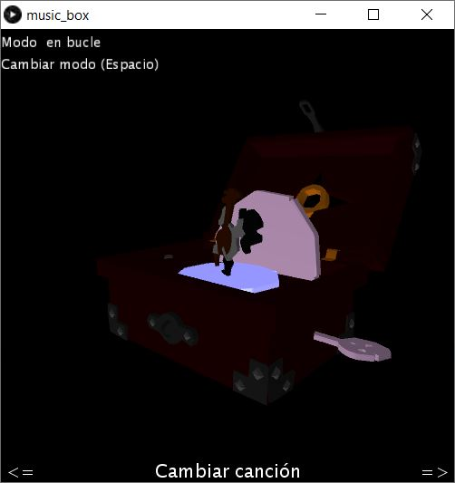

## Procesamiento de sonido

###### Alberto Ramos Sánchez



##### Aviso
> __La utilización de este programa requiere la instalación de las librerías [*SoundCipher*](http://explodingart.com/soundcipher/) y [*Sound* de *Processing*](https://processing.org/reference/libraries/sound/Sound.html)__

#### Controles

- Cambiar de modo (Espacio) : cambiar entre modo bucle, modo dar cuerda con la voz o dar cuerda con la tecla Enter.
- Cambiar de canción (flecha izquierda y derecha): cambiar la canción que suena en la caja de música.

#### Música mediante partituras

Las dos primeras canciones del programa se reproducen mediante este modo.

Las canciones se almacenan en ficheros de texto, donde están representadas las notas y símbolos musicales a ser reproducidos.

El formato del fichero es:

  ```
  nota nota|simbolo
  ```
y para los silencios:

  ```
  |simbolo
  ```

Los símbolos nos permiten calcular, a partir del valor de BPM de la partitura, el tiempo que sonará un acorde/nota.

Calculamos el tiempo que suena una negra con la inversa del *bpm*. Los tiempos para los demás símbolos se obtienen a partir de este tiempo:

| Símbolos / Silencios | Relación | Tiempo (seg) |
|----------------------|----------|--------------|
| Longa                | 16       | 60*(16/bpm)  |
| Cuadrada             | 8        | 60*(8/bpm)   |
|  Redonda             | 4        | 60*(4/bpm)   |
| Blanca               | 2        | 60*(2/bpm)   |
| Negra                | 1        | 60*(1/bpm)   |
| Corchea              | 1/2      | 60*(1/2*bpm) |
| Semicorchea          | 1/4      | 60*(1/4*bpm) |
| Fusa                 | 1/8      | 60*(1/8*bpm) |

El valor de la nota (en notación americana) es convertido a valor MIDI utilizando la función Frequency.ofPitch(note).asMidiNote().

Debido a la incompatibilidad entre la librería *Minim* y la librería *SoundCipher*, están precargados todas las posibles notas en un diccionario, leído desde un fichero.

Las notas/acordes son reproducidos mediante la librería *SoundCipher*:

```java
SoundCipher.playChord(pitches, dynamic, dur);
```

##### Reprodución y pausa

La canción se reproduce lanzando un hilo, el cual reproduce una a una cada nota de la partitura.

Las notas en la partitura son recorridas línea a línea por la clase *Sheet*, que funciona como un iterador.

La clase *Player* solicita cada nota, interpreta la partitura formateando cada línea del fichero; y la reproduce utilizando la clase *Instrument*, que recibe las notas a reproducir y las traduce a valor MIDI, haciéndola sonar con la librería *SoundCipher*.

El hilo que se encarga de reproducir la canción, recorre un bucle que va pidiéndo a la clase *Player* que reproduzca una a una las notas de la partitura.

```java
void execute_music() {
  do {
    p1.playNext(bpm);
  } while(running);
}
```

Para pausar la canción salimos del bucle cambiando el valor del *flag*. Para pararla, además, reseteamos la clase *Sheet* llevándo el contador de línea al inicio del fichero.

```java
Sheet.reset();
```

###### Dar cuerda

Para dar cuerda a la caja de música creamos la animación moviéndo la palanca de la caja al sentido contrario y parándo los demás objetos.

Cuando entramos en modo "dar cuerda", la velocidad de la animación no es constante en el tiempo, sino que va disminuyéndo según una constante de fricción. Para conseguir el efecto de "dar cuerda", aumentamos esta velocidad de nuevo cuando el usuario pulsa Enter o habla al micrófono.

Para el modo "dar cuerda con voz" analizamos el nivel de volumen, y cuando es mayor al 20%, damos cuerda a la caja de música.

```java
  IN = new AudioIn(this, 0);
  IN.start();
  nivel = new Amplitude(this);
  nivel.input(IN);

  float volumen = nivel.analyze();

  if(volumen > 0.2) {
    MusicBox.windUp();
  }
```


#### Música por archivos MIDI
Las dos últimas canciones se reproducen desde ficheros *MIDI*.


```java
SoundCipher.playMidiFile(".\\music\\pirates_nobuo.mid", bpm4);
```

Para pausar la canción se utiliza el método *stop*:

```java
SoundCipher.stop();
```


#### Referencias

- [Caja de música](https://sketchfab.com/3d-models/sea-of-thieves-music-box-70de9ea240e84ad99c4f721c3cce251a)
- Música : <https://bitmidi.com>
- Signos musicales : <https://es.wikipedia.org/wiki/Signos_musicales>
- SoundCipher : <http://explodingart.com/soundcipher/>
- [Blender](https://www.blender.org/) : Edición de los archivos *obj*
